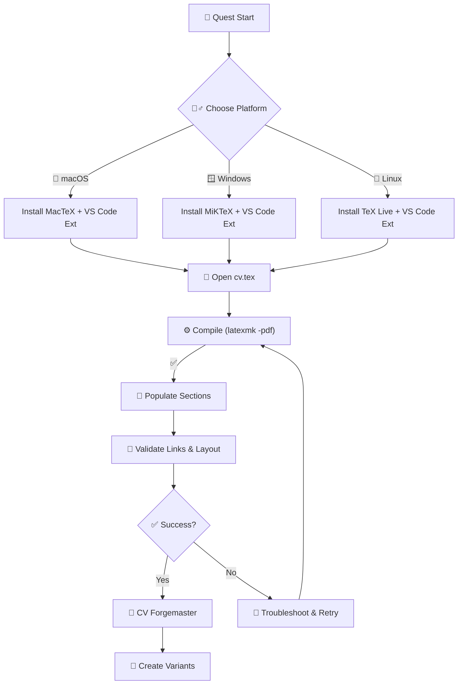

## 🧙‍♂️ Epic Introduction

In the vast digital matrix where data flows like rivers of light, the guild calls you to forge your most enduring artifact: your Curriculum Vitae. This quest is a binary incantation at Level 0101 (5)—a tool‑mastery adventure to craft a polished, ATS‑friendly CV using VS Code and LaTeX. Your primary artifact, the template `cv.tex`, awaits in your vault (e.g., `cv/cv.tex`). You will customize its runes (sections), compile it into a pristine PDF, and emerge with a battle‑ready professional codex.

You’ll master LaTeX Workshop in VS Code, install the proper TeX distribution for your realm, customize sections like Education, Professional Experience, Projects, and Skills, and verify clickable links and fonts. When the final spell completes, your CV will compile cleanly—ready to present to any council of hiring sages.

### 🌟 The Legend Behind This Quest

Across realms, masters encode their journeys in machine‑readable scrolls that pass ATS trials. LaTeX transforms chaos into elegant structure and precise typography. With VS Code as your processing crystal, you’ll weave algorithmic layout spells into an artifact that compiles flawlessly on any platform.

---

## 🎯 Quest Objectives

By the time you complete this journey, you will have:

### Primary Objectives

- [ ] Install a LaTeX toolchain and VS Code extensions for your platform
- [ ] Open and compile the provided `cv.tex` to PDF without errors
- [ ] Replace placeholders with your own details across Contact, Education, Experience, Skills, and Strengths
- [ ] Ensure links (email, LinkedIn, GitHub, website) are clickable (PDF)

### Secondary Objectives (Bonus)

- [ ] Add a headshot image and verify layout alignment
- [ ] Create role‑specific variants (e.g., Tech vs. Finance) via Git branches or file copies
- [ ] Configure a VS Code build recipe (`latexmk -pdf`) and forward‑search preview

### Mastery Indicators

- [ ] You can compile from VS Code and from the terminal
- [ ] You can add new sections (Projects/Certifications) using the template’s custom commands
- [ ] You can troubleshoot missing packages and path issues

---

## 🌍 Choose Your Adventure Platform

Different platforms offer unique paths. Choose your realm.

### 🍎 macOS Kingdom Path

```zsh
# Install VS Code extension
# In VS Code: Extensions → install "LaTeX Workshop" by James-Yu

# Install MacTeX (no GUI) or BasicTeX (lighter)
brew install --cask mactex-no-gui

# Ensure TeX binaries are on PATH for shell and VS Code
echo 'export PATH="/Library/TeX/texbin:$PATH"' >> ~/.zshrc
source ~/.zshrc

# Optional: verify toolchain
which latexmk && latexmk --version
```

Notes:

- If you prefer a smaller footprint: `brew install --cask basictex` then
  `sudo tlmgr update --self && sudo tlmgr install latexmk fontawesome5 CormorantGaramond`.

### 🪟 Windows Empire Path

```powershell
# Install MiKTeX
# Download from https://miktex.org/download and complete setup
# During first compile, allow package on-the-fly installation

# VS Code: install "LaTeX Workshop" extension
```

### 🐧 Linux Territory Path

```bash
# Debian/Ubuntu
sudo apt-get update
sudo apt-get install -y texlive-full
# or minimal + extras
# sudo apt-get install -y texlive-latex-recommended texlive-latex-extra texlive-fonts-extra latexmk

# VS Code: install "LaTeX Workshop" extension
```

### 📱 Universal Web Path (Optional)

If local toolchains are restricted, you can test in Overleaf, then return to VS Code to finalize. This quest focuses on local VS Code mastery.

---

## 🧙‍♂️ Chapter 1: Awaken the Processing Crystal (VS Code + Extensions)

### ⚔️ Skills You'll Forge

- Install and verify TeX toolchain and LaTeX Workshop
- Understand default recipes (`latexmk -pdf`)
- Use Preview (forward/inverse search)

### 🔧 Implementation: Verify the Forge

Don't have `cv.tex` yet? Create it first from the self‑contained starter in [Chapter 2](#-chapter-2-summon-the-template-create-cvtex), then return here.

Open VS Code → open the `cv/` folder → open `cv.tex`. Use the TeX sidebar (TeX icon) and run “Build LaTeX project”. If the build fails with missing packages, install them via your TeX package manager (`tlmgr` on macOS BasicTeX/TeX Live, MiKTeX on Windows).

Tip: LaTeX Workshop usually runs `latexmk -pdf`. You can also compile in a terminal:

```bash
latexmk -pdf cv.tex
```

---

## 🧙‍♂️ Chapter 2: Summon the Template (Create cv.tex)

Your core artifact is `cv.tex`. Create it now: make a `cv/` folder, then save the starter below as `cv/cv.tex`. It is self‑contained—it uses only base TeX Live packages and defines the custom commands (`\resumeSubheading`, `\resumeItem`, and the list helpers) that you will use in Chapter 3, so it compiles cleanly with a stock LaTeX install.


```latex
\documentclass[letterpaper,11pt]{article}

\usepackage[margin=1in]{geometry}
\usepackage{enumitem}
\usepackage{titlesec}
\usepackage[hidelinks]{hyperref}

% ATS aid: map glyphs to Unicode so PDF text stays selectable and searchable
\pdfgentounicode=1

% --- Custom commands used throughout this CV ---------------------------------
\titleformat{\section}{\large\bfseries}{}{0em}{}[\titlerule]

\newcommand{\resumeSubheading}[4]{%
  \vspace{2pt}\noindent
  \textbf{#1}\hfill\textit{#2}\\
  \textit{#3}\hfill\textit{#4}\par
}

\newlist{resumeItems}{itemize}{1}
\setlist[resumeItems]{leftmargin=1.5em,label=\textbullet,topsep=2pt}
\newcommand{\resumeItem}[1]{\item #1}
\newcommand{\resumeItemListStart}{\begin{resumeItems}}
\newcommand{\resumeItemListEnd}{\end{resumeItems}}

\begin{document}

\begin{center}
  {\LARGE\textbf{Your Name}}\\[2pt]
  \href{mailto:you@example.com}{you@example.com} \textbar{}
  \href{https://www.linkedin.com/in/yourhandle}{LinkedIn} \textbar{}
  \href{https://github.com/yourhandle}{GitHub}
\end{center}

\section{Education}
\resumeSubheading{Your Institution}{2019 -- 2023}{B.S. in Your Field}{City, ST}
\resumeItemListStart
  \resumeItem{GPA, honors, or relevant coursework}
\resumeItemListEnd

\section{Professional Experience}
\resumeSubheading{Your Company}{Jan 2023 -- Present}{Your Title}{City, ST}
\resumeItemListStart
  \resumeItem{Delivered X by doing Y, resulting in Z\% improvement}
  \resumeItem{Built A using B and C; reduced cost or time by N}
\resumeItemListEnd

\section{Skills}
\resumeItemListStart
  \resumeItem{Languages: \ldots}
  \resumeItem{Tools: \ldots}
\resumeItemListEnd

\end{document}
```


Once saved, compile it from a terminal in the `cv/` folder to confirm the toolchain works:

```bash
cd cv
latexmk -pdf cv.tex
```

This produces `cv.pdf`. With the artifact in place, return to Chapter 1's build step—the VS Code "Build LaTeX project" button runs the same `latexmk -pdf` recipe on this file.

> **Optional upgrades:** once the base template compiles, you can add richer packages such
> as `fontawesome5` (icons), `CormorantGaramond` (typeface), `multicol`, or a headshot via
> `\includegraphics[width=0.15\linewidth]{headshot.jpg}`. Install any missing package with
> your TeX manager (e.g., `tlmgr install fontawesome5 cormorantgaramond`) before using it.

### 🔧 Implementation: Prepare Assets

- Place your headshot image in the same directory as `cv.tex` and update the filename if needed
- Verify `PATH` includes TeX binaries so VS Code can spawn the compiler
- If fonts are missing, install via your TeX manager (e.g., `tlmgr install CormorantGaramond fontawesome5`)

---

## 🧙‍♂️ Chapter 3: Engrave the Runes (Customize Sections)

Use the template’s custom commands to populate your story.

### Education

Fill each school with `\resumeSubheading{Institution}{Dates}{Degree}{Location}` and a nested bullet list for GPA/Emphasis.

### Professional Experience

For each role, use `\resumeSubheading{Company}{Dates}{Title}{Location}` and add quantified bullets with `\resumeItem{...}`. Keep 3–5 bullets per role.

### Projects / Skills / Strengths

Populate as provided in the template. Add new items using the same list patterns and keep concise, outcome‑focused language.

Example snippet (structure only):

```tex
\resumeSubheading{Your Company}{Jan 2023 -- Present}{Your Title}{City, ST}
  \resumeItemListStart
    \resumeItem{Delivered X by doing Y, resulting in Z% improvement}
    \resumeItem{Built A using B and C; reduced cost/time by N}
  \resumeItemListEnd
```

ATS Tip: Keep graphics minimal, keep text selectable, and ensure links use `\href{}`. The template already activates Unicode mapping.

---

## 🧙‍♂️ Chapter 4: Compile, Validate, and Polish

### Build

- Use the TeX sidebar Build button, or run `latexmk -pdf cv.tex`
- Resolve missing packages when prompted

### Validate

- Ensure the PDF has clickable email/LinkedIn/GitHub links
- Verify headshot placement (or comment it out if not desired)
- Confirm sections fit on 1–2 pages; trim where needed

### Polish

- Use strong verbs, quantified results, and consistent tense
- Keep consistent punctuation and spacing in bullets
- Update last modified date if you track it in the doc

---

## 🧙‍♂️ Chapter 5: Variants, Versioning, and Automation

- Create copies: `cv-tech.tex`, `cv-finance.tex` for role targeting
- Track changes in Git; commit PDFs to a `dist/` folder if desired
- Optional LaTeX Workshop recipe (settings JSON) for explicit control:

```json
{
  "latex-workshop.latex.recipes": [
    { "name": "latexmk (pdf)", "tools": ["latexmk"] }
  ],
  "latex-workshop.latex.tools": [
    { "name": "latexmk", "command": "latexmk", "args": ["-pdf", "-interaction=nonstopmode", "-synctex=1", "%DOC%"], "env": {} }
  ]
}
```

---

## 🎮 Quest Implementation Challenges

### Challenge 1: First Forge (🕐 20–30 minutes)

**Objective**: Compile `cv.tex` without errors and open the PDF.

**Requirements**:

- [ ] Install TeX distribution and LaTeX Workshop
- [ ] Build from VS Code

**Success Criteria**:

- [ ] PDF generated in the project folder

### Challenge 2: Carve Your Story (🕐 30–45 minutes)

**Objective**: Populate Contact, Education, Experience for at least two roles.

**Requirements**:

- [ ] Replace placeholders with your details
- [ ] 3–5 quantified bullets per role

**Success Criteria**:

- [ ] No overfull hboxes; clean layout

### Challenge 3: The Finishing Runes (🕐 20–30 minutes)

**Objective**: Add Skills and Strengths; verify clickable links and (optional) headshot.

**Bonus**:

- [ ] Add Certifications section using the same list structure
- [ ] Create a second tailored variant

### ✅ Quest Completion Verification

- [ ] Build succeeds from VS Code and terminal
- [ ] PDF is ATS‑friendly (selectable text, Unicode mapping)
- [ ] Links work; content fits 1–2 pages
- [ ] Sections aligned with template commands

---

## 🎁 Quest Rewards and Achievements

### 🏆 Achievement Badges

- CV Forgemaster (LaTeX)
- Workshop Weaver (VS Code Build)

### ⚡ Skills Unlocked

- LaTeX document structure and compilation
- VS Code LaTeX Workshop workflow
- Professional CV authoring patterns

### 🛠️ Tools Added to Your Arsenal

- LaTeX Workshop, TeX Live/MacTeX/MiKTeX, latexmk

### 📈 Your Journey Progress

- Previous: Markdown and editor basics
- Current: Compile‑ready professional CV
- Next: Portfolio site and role‑based variants

---

## 🔮 Your Next Epic Adventures

- Level 0100: Chronicle Branching with Git (track CV variants)
- Level 1010: Publish your Portfolio on GitHub Pages
- Level 1100: Typesetting Spells—Advanced LaTeX macros and styling

---

## 📚 Quest Resource Codex

- LaTeX Workshop (VS Code): <https://github.com/James-Yu/LaTeX-Workshop>
- TeX Live: <https://tug.org/texlive/>
- MacTeX: <https://tug.org/mactex/>
- MiKTeX: <https://miktex.org/>
- latexmk: <https://ctan.org/pkg/latexmk>
- fontawesome5: <https://ctan.org/pkg/fontawesome5>
- Cormorant Garamond: <https://ctan.org/pkg/cormorantgaramond>
- Hyperref package: <https://ctan.org/pkg/hyperref>

---



---

### 🧠 Knowledge Check: LaTeX + VS Code

Before you depart, ensure you can:

- Explain how `latexmk` drives the build and where the PDF is produced
- Add a new role using `\resumeSubheading` and `\resumeItem`
- Fix a missing package by installing it via your TeX distribution

---

### 🗺️ Quest Network Position

**Quest Series**: Professional Identity Path

**Prerequisite Quests**:

- Level 0001–0010: Terminal and editor basics (recommended)

**Follow‑Up Quests**:

- Publish your CV on your portfolio site
- Create targeted variants for different roles

---

## ✅ Requirements Coverage

- Aligns to `cv.tex` template (packages, sections, commands)
- Guides VS Code + LaTeX setup across platforms
- Provides objectives, challenges, rewards, validation, and resources

## 🕸️ Knowledge Graph

*Structured wiki-links connect this quest to the IT-Journey knowledge graph. Open the [Obsidian Graph View](/notes/obsidian/graph/) to explore connections.*

**Level hub:** [[Level 0101 - Advanced Docker & DevOps]] **Overworld:** [[🏰 Overworld - Master Quest Map]] **Obsidian docs:** [[Obsidian Knowledge Graph and Wiki Links]]

